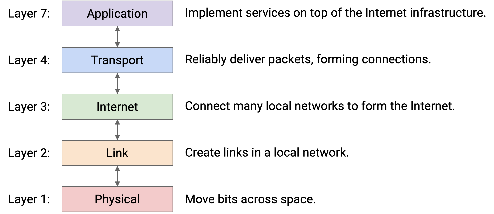
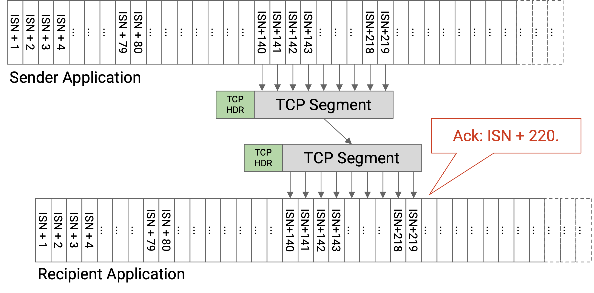
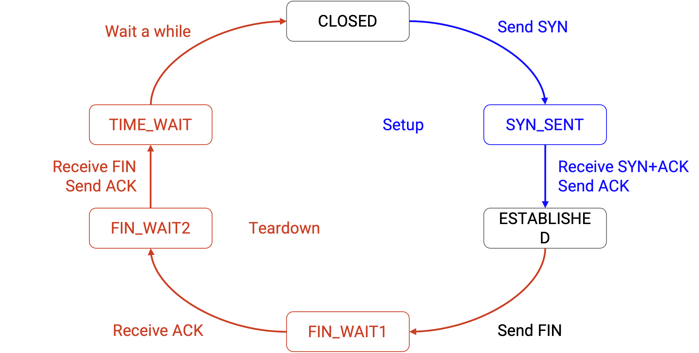

## 前言

一篇迟来的结课报告

说来我对计算机这个领域的第一次产生专业方向的兴趣就是源自计网，高中某一年的暑假偶然在 b 站上看到了名为“简明网络基础”的计网教程，这门教程当时使用的是**自底到顶**的讲法，先从电缆，集线器这类物理设备开始介绍。然后是二层交换机，MAC，ARP等数据链路层内容。再到路由器，IP的网络层。以及那个时候也一直在折腾一些魔法，NAS等奇怪的东西，愈来愈想对它们背后的工作原理做一个了解。

后来高考完的那个暑假，问 GPT 学习计网的书籍，第一个推荐的就是《自顶向下方法》这本。然后我就在去学校的路上打开了它（值得一提的是我后来每次来回的路上都会接着看 ~~，但是现在还没看完🫠~~ ），确实是本好书，从学生最为熟悉的应用层开始，用视频通话、邮件等举例，再依次向下探讨，抽丝剥茧。除了中文翻译不是很通人性以外都很完美。

上大学后先是刷了 CS61ABC，后面明确了后端方向，计网也顺理成章地成为了学习的下一步。最后在 144 和 168 之间选择了 168，理由：

1. 课程内容是完全开源的，可以在官网直接访问到最新与往年的全部课程资料
2. 课程的主讲人是 CS61B 24sp 的 *Peyrin Kao* 老师，他的授课风格我很喜欢
3. 课程的安排采用的是 80min * 27 的安排，比起一节长达几小时的 144 要更容易接受

因此虽然 144 的现代 CPP 框架个人很感兴趣，但是权衡后还是选择了 168

至于为什么是迟来，因为在10月初这个课程基本完结后，被后端项目，期中考，CTF 等事一推再推，然后又陷入了摆烂期。现在趁着期末前 ~~还没有火烧眉毛~~，以及知识还没忘光做个总结

## 课程介绍

### 总览

CSDIY 的介绍：
> 本课程是加州大学伯克利分校开设的“Internet 架构与协议概论”，侧重于 Internet 的设计原则与核心协议，包括分层结构、寻址机制、域内与域间路由、可靠传输、拥塞控制，以及 TCP、UDP、IP、DNS、HTTP 等核心协议，并介绍以太网、无线等网络技术。CS 168 结合理论与实践，通过三个动手项目（Traceroute、路由、TCP传输）让学生学习构建并调试网络协议，体验深入且全面。

## 课程资料

### 版本

课程依然是每年开设两学期，spring 以及 summer，summer 学期更短知识略紧凑，spring 则节奏正常。不过由于计网的体量本身较小，所以差别不大。

课程都没有开放评分机，所以在能获取完整资料的情况下，建议选择最新的版本

以下内容基于 Spring 24 版本

### 资料

1. [CS 168](https://sp25.cs168.io/) (课程官网，可以获取到 PPT，代码仓库以及 lecture 的 Youtube 私享链接)
2. [合集·CS168 SU2025 互联网介绍：架构与协议](https://space.bilibili.com/1683934227/lists/6322688?type=season) (lecture 中译)
3. [Home | CS 168 Textbook](https://textbook.cs168.io/)(课程配套教材，讲得很不错)
4. [UCB CS168: Introduction to the Internet: Architecture and ... - csdiy.wiki](https://csdiy.wiki/计算机网络/CS168%2f)

备注：b站搬运原本的[另一个 25sp](https://www.bilibili.com/video/BV1TktpzcEjk/)中译现在要充电，25su 这版讲的没有 peyrin 好，先凑合看



## 建议

### 学习时长

个人大概花费了 100 小时学习这门课程，不过最后的数据中心等内容因为和国内课程重叠较少，并且没有配套实验，故略过了

因为实验较少，这门课程的体量实际是少于 CS61B 和 CS61C 的（这两尊大佛都花了我快两个月）

### 前置知识

- **Python 编程基础**
课程的 proj 都使用 Python 编写，不过不会涉及到高阶语法，懂得基础的类和方法的用法即可

- **基础的命令行操作能力**
课程提供了本地测试，需使用命令行操作。同时使用也会用到 traceroute 等命令行工具

- **（可选）git 操作能力**
这门课的代码在官网使用压缩包分发，也没有公开的在线评分器，因此 git 是不必要的。

但出于编程的良好习惯，以及计网这门课程的特殊性，依然推荐用 git 管理代码，以便在遇到毁灭性改动时留下回退的余地

- **（可选）数据结构**
在学习路由算法时，事先了解图、生成树的知识对理解算法有很大帮助

### 环境配置

这门课程的环境配置较为简单，只需 Python 即可，为了保持良好环境，建议使用虚拟环境

建议在 (类)Unix 环境中（如 WSL, Mac, Linux 发行版）中完成实验，避免遇到一些奇怪的 bug

## 课程结构

这门课提供了 27 个 lecture，3个 project 以及 13 个 Discussion

### 引论(lec 1 - 3, proj 1)

  在引论部分，我们将初步了解互联网的两个特点：联盟式以及可扩展。这意味这我们需要制定统一的协议来实现数据的交换，并能方便地引入新的主机等设备到网络中

  有了设计目标（联盟式、易扩展），我们需要思考如何实现一个这样的网络
  > [!QUOTE]
  > “Modularity based on abstraction is the way things are done.” (Barbara Liskov, Turing lecture).
  >
  > “基于抽象的模块化是做事的方式。”（芭芭拉·利斯科夫，图灵讲座）

  在网络中，我们选择了**分层**的方法来实现，因为互联网由许多设备（主机、路由器）和许多现实世界的实体（用户、科技公司、互联网服务提供商）组成，而让每个人都同意任务的分解方式是互联网能够规模化运行的关键。

  

  1. 第1层：物理层 (Physical Layer)
    - 功能: 负责在物理空间中传输原始的比特信号（0和1）
    - 技术: 涉及具体的传输介质，如铜线上的电压、光纤中的光脉冲或无线电波
    - 类比: 邮政系统中的邮递员、卡车或信鸽，负责实际运送邮件
  2. 第2层：链路层 (Link Layer)
    - 功能: 在同一局域网（LAN）内的两个直连机器之间建立连接并传输数据
    - 职责:
      - 将比特组装成“帧”或“包”
      - 定义包的起始和结束
      - 处理介质共享问题（如多人同时发送数据）
    - 类比: 连接同一小镇内的两个家庭
  3. 第3层：网络层/互联网层 (Internet Layer)
    - 功能: 将不同的局域网连接起来，实现全球范围内任意两台机器之间的数据传输
    - 核心设备: 路由器（或交换机），负责在不同网络间转发数据包
    - 服务模型: “尽力而为”（Best-Effort）。只承诺尝试投递，不保证数据一定送达、不保证顺序、不保证不丢失
    - 数据单元: “包”（Packet）。将大数据拆分成小块独立传输
    - 类比: 连接不同城镇的邮局网络，实现跨地区、跨国家的邮件投递

  4. 第7层：应用层 (Application Layer)
    - 功能: 为特定的应用程序提供网络服务
    - 特点:
      - 建立在下层提供的基础之上（特别是第4层提供的可靠性）
      - 利用互联网作为一个通用的通信平台，传输任何类型的应用数据（如网页、视频、邮件）
    - 关注点: 实际的用户程序和数据内容（如HTTP、DNS）
    - 类比: 信件的具体内容和用途（如写信是为了问候、寄账单还是发广告）

  Project 1 我们将使用 ICMP 包，使用封装好的 Python Socket 实现一个 Traceroute, 理解如何拆分一个数据包的各段 header 来读懂其中的信息，其中会涉及到 ICMP, IP, Ethernet 协议，通过自行查找相关来理解互联网中的“控制信息”的传递
  总体而言难度不高，包含框架的代码量仅 200 行左右

### 路由(lec 4 - 10, proj 2)

  这章我们将学习传输的数据是如何“寻路”的，也就是**路由**
  针对局域网内部，我们设计出了**内部网关协议（IGPs）**，我们会使用OSPF（开放最短路径优先）和 IS-IS（中间系统到中间系统）
  针对不同网络之间的数据包路由即是**外部网关协议（EGPs）**，而目前互联网上大规模使用的协议称为**BGP（边界网关协议）**

  Project 2 我们需要在框架模拟的主机之间，实现一个**距离向量路由协议（distance-vector routing protocol）**，亲自上手路由的细节，从构建静态路由表到发送 **advertisements**，最后实现**反向中毒（Poison Reverse）**等高阶功能，来规避**广播灾难**

### 传输层(lec 11 - 15, proj 3)

  了解了互联网上的数据包是如何组装以及寻路的，我们需要开始实现如何建立好“连接”，在“尽力而为”的前三层之上实现可靠的数据传输，同时利用**端口（port）**实现解复用，来针对不同的应用程序传输数据。这部分我们将聚焦 **TCP 协议**，了解滑动窗口，握挥手等技术的实现。

  

  

  Project 3 我们需要手搓 TCP 协议，将滑动窗口、重传等逻辑用 Python 代码实现

### 应用层、端到端、数据中心以及杂项(lec 16 - 27)

这部分我们将探讨有关 Http、DNS等应用层协议以及先前忽略的 ARP、DHCP 等对局域网内建立连接至关重要的协议。以及数据中心之间的网络连接等杂项内容

## 感受

### 碎得和乐事薯片一样的后半部分

计网本身是个非常庞大的话题，同时内容不像计组一样有一条清晰的脉络，总体知识很散。可以看出 168 的教学组已经在尽量把化零为整，用三大主题来讲好网络的底层实现。不过后面的第四部分依然是碎成了渣（，每个 lecture 会涉及互不关联的主题，同时也没有配套的实验和项目，反正个人基本上是学了后半节就忘了前半节😇

### **除了网络**

学习计算机时常听到的一句话是“计算机的世界里没有魔法”，现在学完计网我觉得恐怕可以加上后半句——“除了网络”

当涉及到不同设备之间的数据传输时，就会引来很多不确定性。永远忘不了同一个 commit 下，在不同时间，不同位置下跑出来的结果都不一样，有时 All Pass 有时只有一两个😭。甚至搬来了飞猪的参考答案测试也有同样问题，没招了，最后整体测试跑不通，只能给确保每个单侧能单独通过🫠
