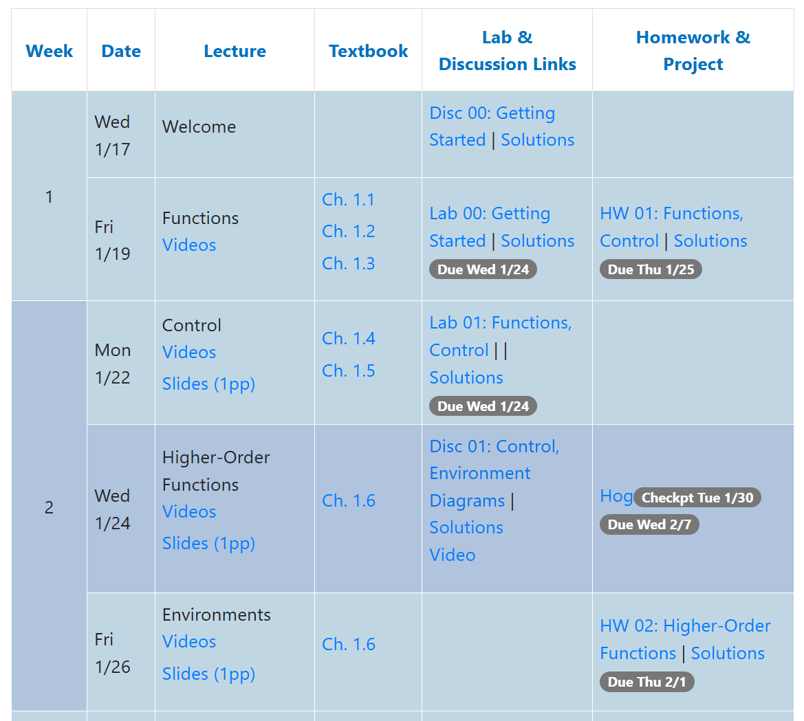
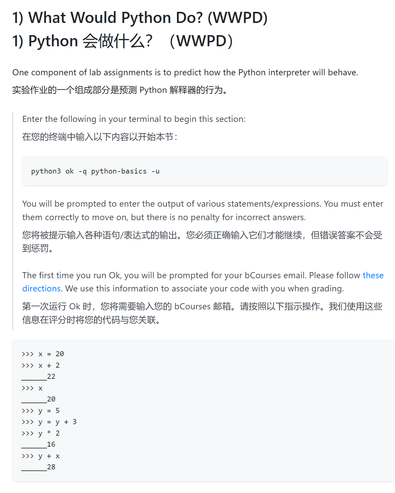
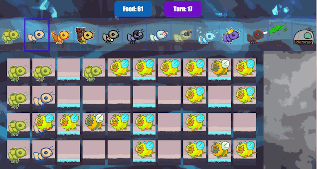
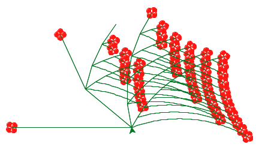

## 前言

　　学完这门课程，我决定用这篇不算长的博客来回顾我这将近一个月的刷课时间。
虽然这个时代 LLM 已经能胜任总结的工作，但是我还是决定以“老师傅匠心手作”的形式完成这篇博客，既是给自己一份交代，也是对这门伟大课程的设计者们的一点敬意吧

　　严格来讲，[计算机教育中缺失的一课 · the missing semester of your cs education](https://missing-semester-cn.github.io/) 应该是我接触的第一门 CS 公开课，但和“小打小闹”的 missing 来对比，比起教你一门具体的技术或是语言，它从更高的层面重塑你对于编程的认识。当你做完Proj.4后再回过头来看课程的全名 *Structure and Interpretation of Computer Programs（计算机程序设计的构造和解释 ）* ，就能感受到课程的设计着实对得起这个标题

## 课程介绍

### 总览

　　引用一段看到的介绍，可以说是对课程内容最好的概括：
>CS61A介绍了编程和计算机科学,重点是抽象技术作为管理程序复杂性的手段。技术包括过程抽象;使用递归、高阶函数、生成器和流控制抽象;使用接口、对象、类和泛型操作符进行数据抽象;以及使用解释器和宏进行语言抽象。该课程向学生提供编程范例，包括函数式、面向对象和声明式方法。它包括对算法的渐近分析的介绍。有几个重要的编程项目。

### 资料

1. [CS 61A Spring 2025](https://cs61a.org/)（如今大部分内容需要登录 UCB 账号查看，且只有当期课程，用处不大）
2. [cs61a | CS自学社区](https://www.learncs.site/docs/curriculum-resource/cs61a/cs61a_en/syllabus) （本人学习的主要来源，有全套的习题实验资料）
3. [【完结】【CS61A精翻双语·英文原声】伯克利大学《计算机程序的结构与解释》(2024)](https://www.bilibili.com/video/BV1sy411z7nA)（课程的中译 lecture）
4. [【re：从零开始的计算机自学之路】CS61A保姆级环境配置教学](https://www.bilibili.com/video/BV1nkizY5E45) （课程所需的环境配置教程，教你怎么快速开始做第一个 lab）
5. [CS自学指南](https://csdiy.wiki/#cs61a) [UCB CS61A: Structure and Interpretation of Computer Programs - CS Plan](https://cs-plan.com/CS%E5%9F%BA%E7%A1%80/%E8%AF%BE%E7%A8%8B%E6%8E%A8%E8%8D%90/%E7%BC%96%E7%A8%8B%E5%9F%BA%E7%A1%80/UCBCS61A/) （课程的介绍，也是本人学习的引路人）

## 个人建议

### 学习时长

__总时长约100~150小时__ 
　　个人从2月27日到3月7日，3月31日到4月18日，每天大约投入4小时学习，才完成了课程的绝大部分内容。而csdiy 上给出的时间是50小时，但显然不太具有参考价值，随个人接受能力调整即可，零基础200小时也是可能的

### 前置知识

__无，但最好有任意至少一门语言的基础__ 
　　正如前面所讲，这是一门从整体角度看待程序设计的课程，所以课内的lecture不会过多地讲解  Python 的语法，对于基本的分支，循环等也不会手把手般地教。
本人开课前有了少量 C 和 Python 基础，因此在语法上少了不少麻烦

### 学习流程： 

　　参考这个[课程表](https://www.learncs.site/docs/curriculum-resource/cs61a/cs61a_en/syllabus)，按课程表横向刷过来就行（这也是国外这些知名课程的优点之一，一个清晰的学习规划更有助于学生的预习复习）

> “学而不思则罔，思而不学则殆 ” —  ~~（孔老二）~~ 孔子

　　需要注意的一点是__不要只看 lecture 不做题！！！__ 
　　这门课的精髓在于练习部分，课程使用 "ok" ——一个专门用于测试的python库来测试，相当方便，有基本的命令行操作经验即可使用（实在不行你问ai吧.jpg）。~~比国内某些高校的上古测试软件高到不知道哪里去了~~

### 翻译： 

　　UCB 的课程只有英文，对于早些年的学生来说，硬啃生肉是肯定的。这种方式虽然对英语水平提升有帮助，但是肯定也能劝退一大部分人了（没错就是我）。好在现在 LLM 的发展给了我们很大帮助，通过[沉浸式翻译](https://immersivetranslate.com/zh-Hans/) 这个插件搭配大模型模式，可以让网页呈现翻译原文共存的形式，在翻译难懂的时候也能及时对照原文

## 课程内容

### Part 1 (Week 1-5)

　　这部分主要带学生入门 Python，与一般的教程不同，课程很早就介绍了帧(Frame)、数据抽象、高阶函数等内容。比如一个简单的列表求和，你会先使用递归而不是循环来解决。还会教你一步步分析环境中变量的值，它们是如何传递的等等。这部分也是一个劝退的高发区，各种高阶函数来回转很容易晕头转向的，这部分也两个 Project —— Hog, Cats。分别需要完成一个骰子游戏和打字游戏。之前的高阶函数等知识点都会在其中体现出来，回答了我刚学时的：“他在讲什么？为什么得这样写？我这样解决不行吗？”的灵魂三问 
　　对帧的可视化：
<iframe width="100%" height="500px" frameborder="0" src="https://pythontutor.com/iframe-embed.html#code=def%20summation%28n,%20term%29%3A%0A%20%20%20%20total,%20k%20%3D%200,%201%0A%20%20%20%20while%20k%20%3C%3D%20n%3A%0A%20%20%20%20%20%20%20%20total,%20k%20%3D%20total%20%2B%20term%28k%29,%20k%20%2B%201%0A%20%20%20%20return%20total%0A%0Adef%20cube%28x%29%3A%0A%20%20%20%20return%20x*x*x%0A%0Adef%20sum_cubes%28n%29%3A%0A%20%20%20%20return%20summation%28n,%20cube%29%0A%20%20%20%20%0Aresult%20%3D%20sum_cubes%283%29&codeDivHeight=400&codeDivWidth=350&cumulative=true&curInstr=9&origin=composingprograms.js&py=3&rawInputLstJSON=%5B%5D"> </iframe>

### Part 2 (Week 6-10)

　　接下来的这部分介绍了迭代器和生成器函数，并且着重讲了面向对象(OOP)的内容，介绍了 Python 中类的创建、继承、属性等。用账户，售货机等例子说明了对象在程序设计中的作用。这个阶段的 Project —— Ants，实现了一个类似植物大战僵尸的游戏。通过创建场景、地块、昆虫的对象以及它们的子对象，能真正体会到对象的有趣之处。

### Part 3 (Week 12-13)

　　第三这部分介绍了 Scheme，一种Lisp方言，推开了函数式编程的大门。刚上手时感觉这和 Python 完全是两个极端，一连串的括号完全看不懂这写的是什么，但是适应了几天会感受到这门语言的强大，只靠无副作用的函数就能完成很多操作，虽然在以后的开发中，你大概率用不到它，但这对于思想的开阔和以后设计的启发是毋庸置疑的。 
　　这部分的 Project 也是利用 Python 实现这门语言的解释器，学生需要填补已经给出的文件中的主要逻辑，实现一个 __REPL 循环 (读取(Read)-运算(Eval)-输出(Print)-循环(Loop))__。这个 Project 也被许多人认为是整个课程的精髓，引导明确右给予了学生充分的自由编写空间（再次膜拜设计者的智慧）

### Part 4 (Week 14-15)

　　最后一部分引入了 SQL (Structured Query Language，结构化查询语言)，借助轻量化的数据库 [SQLite](https://sqlite.org/)，让学生对于数据库有一个初步的认知，了解一下声明式语言的特点

## 体会

### 最后的碎碎念

　　接触这门课之前，我对未来要走的路相当迷茫，对C/C++，前端，算法等等方向属于：有点了解，但不多的情况。。。整天和学校的各种琐事斗智斗勇，回过头来发现自己虽不能说收获颇丰吧，至少也能说是一无所获，每天陷于时间利用的黑洞之中。直到开始刷这门课，以及看到后面各种五花八门的课程方向，才发觉其实未必要这么焦虑，才大一时间还长，大可先打好基础再决定方向 
　　比起学校的课程，学习 John Denero 老师的 61A 是我一天中少有的放松时刻（没错，是放松），自学的模式也能让人放下你追我赶的竞争感，专注于学习内容之上。最后就以他的人生建议作为结束语罢
> Source: [61A Fall 2020 Lecture 38 - YouTube](https://www.youtube.com/watch?v=jbf1B5ZDQr8&t=2881s)  
> When I was getting married, I was a PhD student at the time. My mom pulled me aside on my wedding day and said "John I want to give you some advice". I was like oh she's going to like tell me to listen to my wife or whatever. But she didn't. She said only two words that have stuck with me for a long time. She said "don't compare". That's all. And then she was like okay you can go back to do whatever you're doing. At the time this was very hard for me to process because I was in a university which is all about comparing people based on like what their exam score was. It turns out that out there in the world, there are no exams that everybody takes that are standardized anymore. All that matter is what you go and get done on your own particular path. So, comparing yourselves to other people becomes meaningless rapidly as what really matter is what you could do yourself, like what you're capable of and what you bother to do and how you choose to spend your time. It took years of this two-word phrase "don't compare" to marinate inside of me and for me to realize that my self-worth really has nothing to do with what other people can do or whether I can do it better than them or worse than them. It has everything to do with what i've done and what i'm gonna do next and how I spend my time and better myself. I should just focus on improving myself and forget about what everybody else is doing.  (John Denero)
