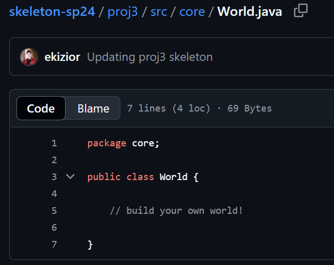

## 前言

> 弈者谋势，不善弈者谋子 -- 《弈林新编》

　　2个月前我刚开始上这门课时，我得到的信息是 "CS61B 是一门披着数据结构和算法课的软件工程课"。如今这门课圆满完结，确实深有体会和国内的数据结构课不同，lecture 中教授的每个数据结构和算法，都是在为你的 project 铺垫。好处就在于，未来我未必记得住教科书上冗长的概念，但我一定记得住想到用最小生成树生成地图房间的那个时刻

## 课程介绍

### 总览

官网课程介绍:
> 在CS61B中，我们将深入到更为细致（一定程度上也更基础）的编程层面，专注于编写程序的设计效率以及运行时的性能优化。
这是一门关于数据结构和编程方法的课程。它恰好也教授Java，因为不借助一门语言很难讲授编程。
然而，本课程并不旨在全面涵盖Java、创建Android应用、用户界面设计、图形处理或其他有趣内容。
部分学员可能已修过数据结构课程，仅希望学习Java或C++。对于你们而言，自学或许是更佳选择。

### 关于版本

　　该课程每年开设两个学期，Spring 以及 Fall，如 24sp 指代 2024 年的春季学期，23fa 指代 2023 年的秋季学期。目前最新的课程即为 25sp

 

**选择哪个版本?** 
　　目前该课程资料公开程度最高的是 21sp，UCB 公开了该课程的 GradeScope 邀请码，意味着你可以像本校学生一样使用在线评测系统，测试你的代码并评分，对于一门重在实践的课程帮助是很大的。这门课的 proj2 的主题也是大名鼎鼎的 *gitlet*，但是资源翻译相对不好找一些 
　　但本人学习的版本是 24sp，主要原因是[CS自学社区](https://www.learncs.site/)提供了这一版本的文档和视频翻译，另外它的 proj2 改为了 *Ngordnet* ，难度与 *gitlet* 相比略有下降。这期课程暂时没有公开 GradeScope 邀请码，但**个人体验来看**本地测试加 AI 检查也能基本保证学习效果，而且通常来讲，越新的课程打磨得也越好 
　　在下面的内容中，我主要提供的都是 *24sp* 版本的资料 

### 资料

1. [CS 61B Spring 2025: Home](https://sp24.datastructur.es/) (课程官网，大部分资料均为公开)
2. [cs61b | CS自学社区](https://www.learncs.site/docs/curriculum-resource/cs61b) (CS自学社区整理的原文学习资源，同时也另有AI中译版本)
3. [【完结】【CS61B精翻双语·英文原声】伯克利大学《算法与数据结构》(2024)](https://www.bilibili.com/video/BV1hJ4m1M7ZA/) (双语字幕 lecture)
4. [UCB CS61B: Data Structures and Algorithms - CS自学指南](https://csdiy.wiki/%E6%95%B0%E6%8D%AE%E7%BB%93%E6%9E%84%E4%B8%8E%E7%AE%97%E6%B3%95/CS61B/) (课程介绍)
5. [UCB CS61B: Data Structures - CS Plan](https://cs-plan.com/CS%E5%9F%BA%E7%A1%80/%E8%AF%BE%E7%A8%8B%E6%8E%A8%E8%8D%90/%E7%AE%97%E6%B3%95%E5%9F%BA%E7%A1%80/UCBCS61B/#_1) (课程介绍)
6. [【re：从零开始的计算机自学之路】CS61B保姆级环境配置教学](https://www.bilibili.com/video/BV1Nc1vYFEfP/)



## 建议

### 学习时长

　　个人总计花费了**55天**完成这门课程，总计时间约**200小时**略多，大概属于平均水平。算法部分花了一些时间刷lc巩固知识，其余大部分时间在写 proj 以及 lab。

### 前置知识

<u>**CS61A或等同知识**</u> 
　　这门课有相当的面向对象编程(OOP)要求，如果只会简单编程，这门课的上手会比较有挑战性~~(坐牢)~~ 
<u>**这门课有微量的命令行操作要求**</u> 
　　比如你需要懂得基础的 git 操作，如clone，pull，commit 等，配置环境时，你需要了解 ssh 密钥对管理的基本操作。但你习惯的话也可以使用对应的 GUI 界面来操作。 

### 流程

　　课程同样提供了完善的[课程表](https://www.learncs.site/docs/curriculum-resource/cs61b/cs61b_en/syllabus)，你可以随时按照它来安排学习进度，复习与查找

### 环境配置

　　课程的 [lab1](https://www.learncs.site/docs/curriculum-resource/cs61b/cs61b_en/labs/lab01) 会教你所有需要用到的环境和操作方法(Idea，git，ssh，GradeScope等)，按教程配置即可，不懂的勤问AI 
　　这门课程的作业几乎全部通过 github 仓库发布，24sp课程的框架代码在官方发布的[这个仓库](https://github.com/Berkeley-CS61B/skeleton-sp24)里都可以找到 
　　由于 java 的依赖管理不如 python 方便，在每个作业开始时需要添加依赖库，[这个仓库](https://github.com/Berkeley-CS61B/library-sp24)里包含了这门课需要的所有库 

## 课程结构

### lab
　　
　　这门课提供了 10 个lab，lab 1 - 4 为配置环境，学习 Idea 调试器以及 git 的使用 
　　lab 5 - 8 提供了接口，让你实现并查集，映射(基于BST)，左倾红黑树以及哈希表 
　　lab 9 - 10 提供了较多的框架代码，让你做一个生命游戏以及俄罗斯方块，目的在于让你熟悉渲染与交互库，便于实现 proj3 

### project

　　这门课提供了 4 个 project 
　　如果说 61A 的 project 是坐着轮椅 (?) 跑的话，那 61B 就是在让你开始独立行走，除了第一个让你熟悉 java 语法的 proj0(2048游戏)，其余都只提供了极少的框架代码，需要你通过所学的知识来填充 

　　proj1 需要你通过两种方法实现双向队列(Deque)，分别是链表和数组，你需要自己思考如何安排数据的存放，扩容等 
　　重要的是，完成这个队列后，你可以使用提供的算法制作一个模拟吉他弦发音的程序，进一步，你可以靠这个解析 midi 文件播放音乐，下一步可以干什么，不用我多说了吧( 

[为什么要在 61b 里演奏春日影！？](https://www.bilibili.com/video/BV1h6VPzUEbJ/)

　　proj2 你可以搭建一个历史词频表，通过提供的数据来查询某些单词的历史频率以及关联 

 

　　proj3 你会利用提供的瓦片渲染引擎，完全从零开始搭建一个 2D 游戏，你可以选择做一个吃豆人，或者是某种地牢游戏，总之扩展性非常高，课程里提供的要求只是让你做一个简单的框架，你可以尽情发挥自己的巧思。比如我看到往期优秀案例中就有
一个实现了伪3d渲染的，我大受震撼。



## 感受

- **设计文档，构思**  
　　如果问我开发这几个项目中感受最深的是什么，我会说写代码 **三思而后行**，比如在 proj2 的项目设计阶段，我泡了一天的图书馆，大半天时间都在思考怎么解析数据，怎么用数据结构把一个个词汇串联起来，怎么保持查找的高效率等等……
最后按要求把想法整合成了一个设计文档，因此我实际编码的时间并没有太长 

　　在 lecture 34 中，讲课的老师也提到他曾经也是编码一时爽，~~重构火葬场，~~后来就规规矩矩写文档了

 

- **AI**  
　　在 proj3 之前，我对于 AI 的态度还是比较保守的，AI 补全我嫌碍事都给关了，使用仅限于找bug。这门课程在也规定不应大量使用 AI。
但是 proj3 解除了这一限制，允许学生使用 AI 来生成方法，设计结构等等。上手一用真的发现效率直线上升，本来可能要半个月的 proj3，几天时间就足够出成品了 (555给AI大人磕头了……)

- **学习动力，正反馈**  
　　对于我来说，没有兴趣的事情我是很难持续做下去的，幸运的是 61b 能极大地激发我的热情。因为这里的每份作业不是为了拷打你的大脑，或是筛选精英。你需要做的就是打开 Idea 敲上几个小时的代码，知识自然就学懂了。 
　　写到这里再次感谢教学团队，他们数十年的心血造就了这门堪称完美的课程，并且还无私的公开。伟大，无需多言

## 杂项

### 一些有(nan)趣(beng)的课堂记录

 
