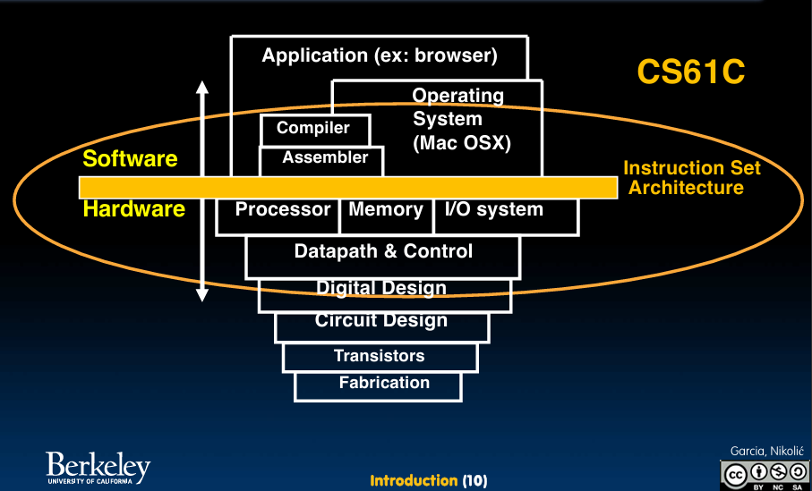
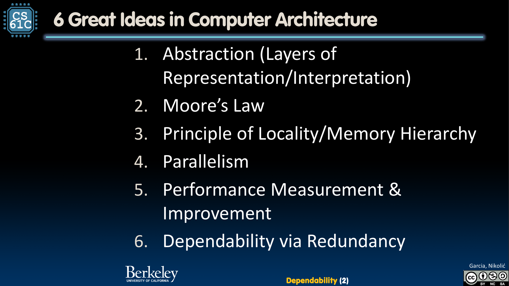
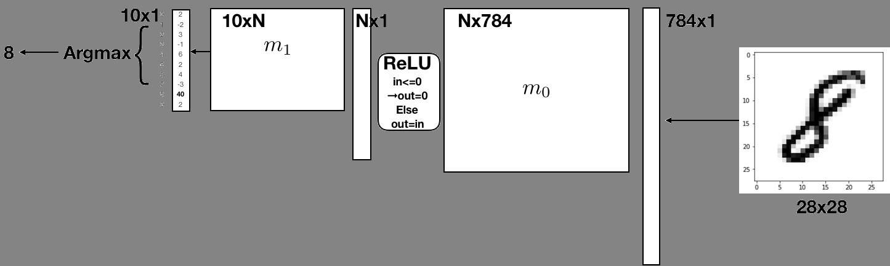
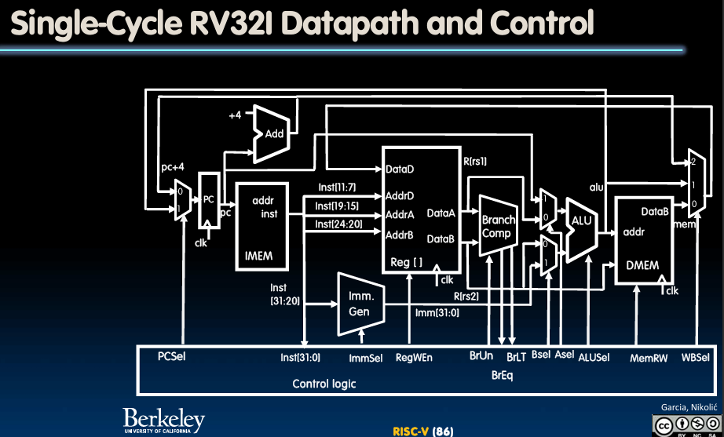

## 课程介绍

### 总览

课程介绍：
> CS61系列的最后一门课程。主要关注计算机架构的重要概念。 课程涵盖的主题包括：C语言与汇编语言编程、高级程序向机器语言的转换、计算机组织结构、缓存技术、性能评估、并行处理、CPU设计、仓库级计算及相关议题。

### 主题

　　课程的全名是 *Great Ideas in Computer Architecture(计算机体系结构中的伟大思想)*, 课程围绕这以下六大思想展开教学

1. 抽象（表述/解释的层次）
2. 摩尔定律
3. 局部性原则/内存分层
4. 并行性
5. 性能测量与改进
6. 冗余以实现可靠性!

　　课程从数字表述和基础 C 程序开始介绍，再带我们了解程序的内存结构。接下来学习 RISC-V 汇编，来理解我们的 C 程序是如何转换为更底层的汇编，再到机器码的 
　　在软件部分完成后，我们将了解简单的逻辑电路，时钟，组合逻辑。接着我们将从零设计一个 RV32 架构的 RISC-V CPU, 实现数据路径，控制逻辑，最后使其流水线化 (pipelined) 
　　最后我们将回顾所学知识，再学会如何用并行化来优化我们的计算机体系，使其能更高效地胜任大规模计算 

## 课程资料

### 版本

　　该课程每年开设两个学期，Summmer 和 Fall, 需要注意的是 Fall 学期的课程为 4 个月，内容较完整，节奏正常。而 Summer 学期仅有两个月，节奏很快，内容也有部分缩减，更多供本校学生重修刷分用。自学更建议学习 Fall 课程。 
　　61C 的课程开放程度相对不高，各学期都没有公开自动评分系统的邀请码，所以没有特定的版本推荐，可选择手头资料比较多的学期 
　　以下内容都基于 Fa20 版本 

### 资料

1. [CS 61C](https://cs61c.org/)(课程官网)
2. [cs61c | CS自学社区](https://www.learncs.site/docs/curriculum-resource/cs61c/syllabus)(CS自学社区提供的资料存档)
3. [【完结】【CS61C精翻双语·英文原声】伯克利大学《计算机体系结构》(2020)](https://www.bilibili.com/video/BV17b42177VG/)(双语字幕 lecture)
4. [UCB CS61C: Great Ideas in Computer Architecture](https://csdiy.wiki/%E4%BD%93%E7%B3%BB%E7%BB%93%E6%9E%84/CS61C/)(课程介绍)
5. [【re：从零开始的计算机自学之路】CS61C保姆级环境配置教学](https://www.bilibili.com/video/BV1yhUiYMEJN/)(环境配置教学)



### 小工具

- [RISC-V 指令集参考手册](https://ai-embedded.com/risc-v/riscv-isa-manual/)(查询 RISC-V 汇编格式与作用)
- [RISCV_CARD.pdf](https://www.cs.sfu.ca/~ashriram/Courses/CS295/assets/notebooks/RISCV/RISCV_CARD.pdf)(RISC-V 指令的二进制格式参考)
- [[ RISC-V Instruction Encoder/Decoder ]](https://luplab.gitlab.io/rvcodecjs/)(提供 RISC-V 汇编到二进制的转化)

## 个人建议

### 学习时长

　　个人在暑假花费了 **37** 天完成这门课程， 总计时长约 **200小时**，与 61b 类似 

### 前置知识

<u> [CS 61A](https://cs61a.org)</u> 
　　这门课需要有扎实的程序设计基础，以及对数据抽象的了解。并且也会用上在此所学的 Python 
<u> [CS 61B](https://datastructur.es)</u> 
　　这门也需要一定的算法基础（其实不是很重要），以及初步管理大规模项目的能力，这点在 proj 3, 4 中较为重要。并且这门课中学习的命令行操作也十分重要，你将进一步学习 make, gdb 的用法

### 环境配置

　　由于课程内容跨度大，环境配置也相对复杂一些，总共你将在 4 种不同的环境中工作。但都提供了完善的 lab 辅助上手 
　　课程的 Makefile 以及运行库主要是为 Linux 设计的，Windows 用户建议使用 WSL, 能减少一些不必要的麻烦 
　　课程的 lab 和 proj 都公开在 github 上，可以在[这个账号](https://github.com/61c-teach)寻找自己所学版本对应的初始文件 

## 课程结构

这门课提供了 40 个 lecture, 12 个 lab, 4 个 project, 11 个 homework

1. 第一部分(lec 2 - 6, lab 1 - 2, proj 1) - C
    这部分你将从整形的数字表示开始，了解为什么在最后补码成为了整数表示的赢家。 
    紧接着你将学习 C 的基础语法，以及它的灵魂——指针和内存管理。手动分配和释放内存相当的麻烦，但也能让人深刻了解内存管理的重要性。 
    这部分的 Project A 部分你将先实现一个能将图片转换为 PPM 文本格式的程序，随后 B 部分将借此完成一个生命游戏的彩色版本，分解每个像素三个色彩通道各 8bit 的数据，在每个位上分别运行生命游戏 

    

2. 第二部分(lec 7 - 13, lab 3 - 4, proj 2) - RISC-V Assembly
    在学习了 C 语言后，我们将更深入一步探讨它是如何转化为机器更易读的汇编的，我们将使用 RISC-V 汇编来在寄存器中操作数据，体会 ISA 设计者们的巧思，如何在固定的 32 位内塞下不同种类的指令与数据，实现内存读写，分支跳转等操作 
    这部分的 Project 将带你使用汇编语言，完成神经网络中需要用到的函数，最后利用提供的预训练矩阵来实现对 MNIST 数据集的手写数字分类 
    对于用汇编编程，我的评价就像是在刀剑上跳舞，前一周还在吐槽 C 的内存管理麻烦的我感觉 C 此刻都是无比眉清目秀。。。 
    但是能从一个程序的最小单元考虑设计确实也能为以后的写码带来启发，比如你知道什么样的程序更容易被编译器优化，分支 (if-else) 的背后逻辑 

    

3. 第三部分(lec 14 - 31, lab 5 - 8, proj 3) - Hardware
    在掌握了 RISC-V 汇编后，马上你会开始学习如何设计一个能解码执行这个指令的 CPU。 
    从基本的逻辑门，时钟同步。你将从最简单的电路开始，在 logisim 仿真软件中绘制电路图。并且学习 CPU 设计中最重要的数据路径和指令控制部分，最后需要把所学知识整合起来，将它们组合成一个能解码 RV32 指令的完整 CPU。 
    程序计数器、RegFile、ALU、控制逻辑、立即数生成、CSR。这些组件你都需要亲自在Project 3 中从零制作，并且完成对 CPU 的流水线化 
    这个部分也是我认为的课程精华部分，有男人能拒绝手搓一个 CPU 出来吗?.jpg

    

    完成 CPU 设计之后你还会了解缓存，虚拟内存，I/O的知识，为接下来的优化部分打基础
4. 第四部分(lec 32 - 39, lab 9 - 11, proj 4) - Parallelism
    最后一部分，你将认识多种并行优化方式，比如： 
    - 指令级并行, CPU 利用额外寄存器，实现单指令多数据(SIMD)计算
    - 线程级并行，如何设计一个多核处理器，并且保证数据一致性
    - 集群运算，将大任务分配到不同机器上，将任务分开完成再汇总

    Project 4 将利用 C 实现一个矩阵运算的 python 库，并通过 AVX 指令和 OpenMP 实现并行化加速，最后和 numpy 进行速度比较

## 感受

- **依旧实践先行**  
　　这门课有着 UCB 一贯的实践优先的理念，大部分 lecture 的知识点都有配套的 lab 需要完成，避免一听就会一考就废
　　计算机组成原理的确是一门很难教的科目，以至于很多高校都把这门课上成了文科课，考察方式集中在对概念的记忆，很难说期末结束后还记得些什么，优化自身的编码能力更是无从谈起
- **难度最大的项目？**  
　　这门课程的 Project 3 是我刷课以来遇到的最有挑战性的项目，因为测试流程需要 UCB 账号，在摸索出方法前基本都是靠古法调试——摸电线 ~~30年的老电工，这线有没有电我一摸就知道~~ 
　　由于不是代码项目，AI 能提供的帮助也相对有限，出现的问题都需要抽丝剥茧，一步步找到根源 
项目从 ALU 开始到测试结束，前后共花了整整 10 天，确实很有挑战性
