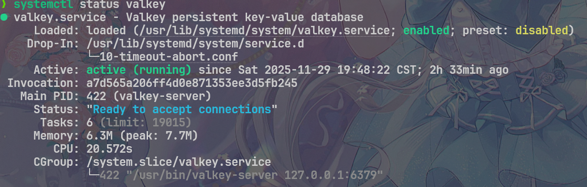

## 前言

最近正式开始学习后端开发，因为在 61b 里面已经有了 java 语法基础，所以直接开了苍穹外卖来上手

有一说一，因为这个项目的知名度过高，以至于每年各公司的 HR 都会收到上百份写着**编写过苍穹外卖项目**的简历，几乎成了扣分项

但是也侧面印证黑马这个课程的含金量， ~~以及高校计算机教育的拉胯，~~ 作为一个后端程序员初步项目还是不错的

所以这里会记载一些个人在学习过程中的感悟总结，风格会比较散 ~~（梦到哪句说哪句）~~

我的后端代码实现都上传到了[这个仓库中](https://github.com/Weedy233/Sky-Takeout-Backend)

## 技术栈

- 核心： Spring Boot, Mybatis
- 数据库：MySQL, Redis
- 中间件/工具：Nginx(反代), WebSocket(消息推送), OpenAPI/Knife4j
- 开发环境：JDK 17 (Windows 11 x64), VSCode, Maven

## 项目内容

### Maven 结构

整个后端使用 maven 作为构建系统，由三个部分组成：

- `sky-common`: 工具，异常，常量定义等通用资源
- `sky-pojo`: 实体以及相关的 VO，DTO
- `sky-server`: 项目的逻辑部分，负责相应请求，与数据库交互等

每个子项目有独立的 `pom.xml`，用于配置依赖
主项目的 `pom.xml` 负责将子项目组合成整体，编译打包

### 开发历程

1. day1: 介绍，设置管理端前端，导入接口文档
2. day2: 开发员管理端工管理、商品分类管理部分
3. day3: 开发菜品部分，利用 AOP 完成公共字段填充
4. day4: 开发套餐部分
5. day5: 上手 Redis 使用，用其存储店铺营业状态
6. day6: 上手微信小程序开发，设置用户端前端，完善微信用户登录功能
7. day7: 使用 Spring Cache 优化菜品数据访问，开发用户端购物车部分
8. day8: 开发用户端地址薄，下单功能
9. day9: 开发管理端用户端订单操作部分
10. day10: 使用 Spring Task 配置定时任务，自动处理超时/未完成订单。使用 WebSocket 实现来单和催单提醒
11. day11: 开发管理端数据统计功能
12. day12: 开发管理端数据统计导出 excel 功能

## 问题与解决

### 工程/代码相关

#### 公共字段填充

- 问题：公共字段 `create_time/user...` 赋值代码重复繁琐
- 解决：
  1. 通过编写 `AutoFill.java` 使用反射获取 Setter 方法，
  2. 在需要使用的 Mapper 接口加上 `@AutoFill(value = OperationType.<INSERT/UPDATE>)` 注解，
  3. 调用时自动实现公共字段自动填充

- 问题：个人认证小程序无法使用支付功能，故无法完成需要订单提交功能的软件测试
- 解决：
  编写 mock 逻辑，当在小程序端点击付款，且配置的微信支付相关 token 为 *** 时，自动触发支付回调方法，完成订单付款
  我的代码实现可见[此处](https://github.com/Weedy233/Sky-Takeout-Backend/blob/706cd78afa75535203f670e6fc24bc6e3a1c905e/sky-common/src/main/java/com/sky/utils/WeChatPayUtil.java#L236)

### 业务相关

#### 菜品缓存优化

- 问题：微信用户端查询分类下菜品时需频繁调用 Mapper 查询数据库，造成性能瓶颈
- 解决：
  1. 在 `config\` 中注册 redis 模板对象
  2. 对查询方法使用 `@Cacheable` 注解，对修改或删除方法使用 `@CacheEvict` 注解
  3. 在方法中添加完成对 redis 的获取或更新删除操作
  4. （可选）配置 redis 序列化器

- 思考：课程中的默认方案是

```java
@Bean
public RedisTemplate<String, Object> redisTemplate(RedisConnectionFactory redisConnectionFactory) {
    log.info("开始创建 redis 模板对象...");
    RedisTemplate<String, Object> redisTemplate = new RedisTemplate<String, Object>();

    redisTemplate.setConnectionFactory(redisConnectionFactory);

    redisTemplate.setKeySerializer(new StringRedisSerializer());
    return redisTemplate;
}
```

这种方法非常简单粗暴，虽然不会报错和产生读取问题，但是使得存入 redis 的对象以 java 二进制形式呈现，不便于查看与跨平台。应该为每个类配置单独的序列化器以 json 形式存入

以及项目提供的 Windows Redis 实在是太远古了，已经多年没有维护，严重跟不上时代。建议使用 WSL 搭配 Valkey / Redis 提供缓存服务



#### 超时订单自动处理

- 问题：
