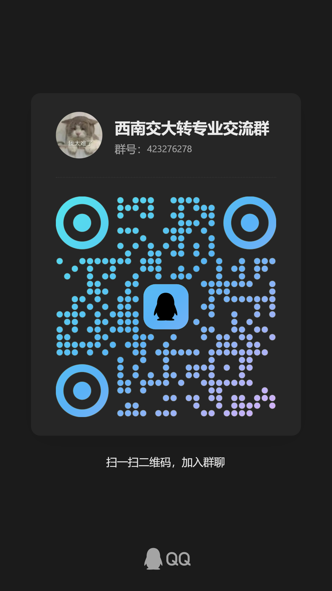
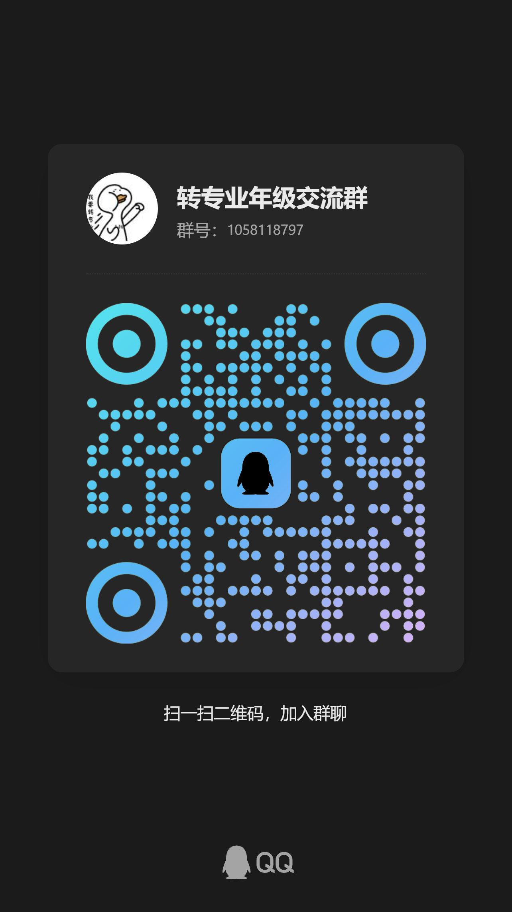
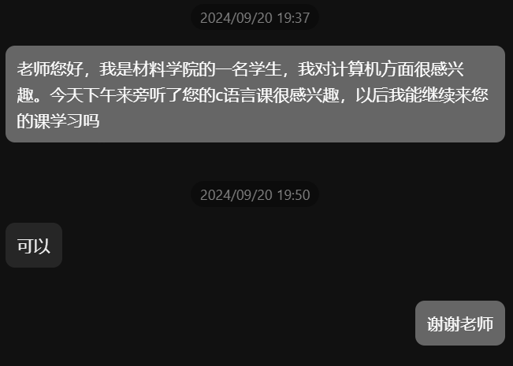
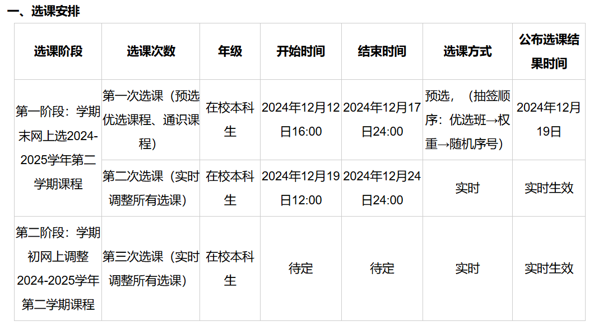
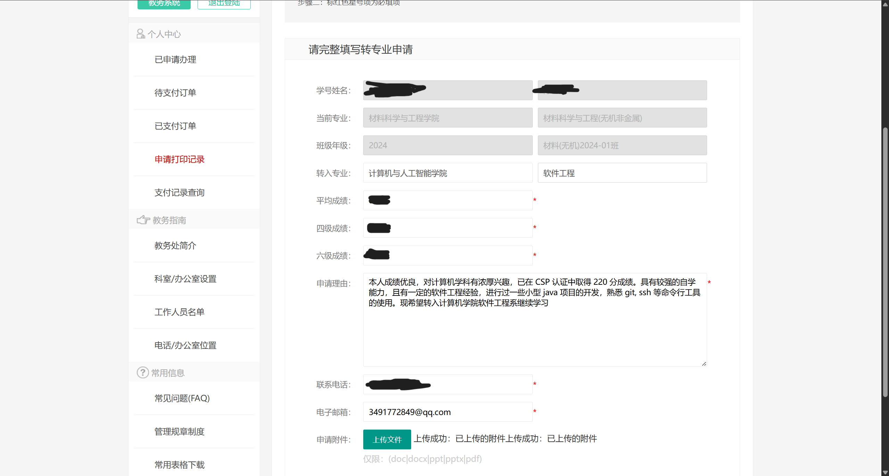
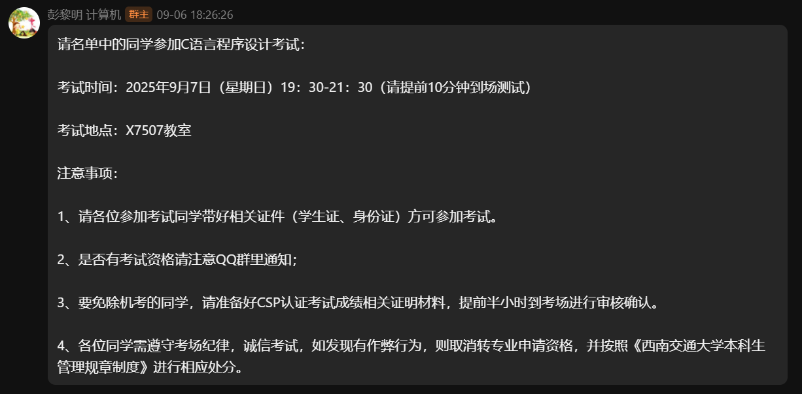

## 前言

> [!QUOTE]
> ”雄关漫道真如铁，而今迈步从头越“ ——《忆秦娥·娄山关》

用一些话语，记录我从一个九月到另一个九月的故事。。。

### 备注

> [!DANGER] Remark
> - 由于各学院的要求不同，所以部分步骤可能需根据你的原专业与目标专业变动
> - 文章假设你是大一新生，对于大二生部分步骤可能有所变化

## 个人信息

- 年级：2024级
- 原学院专业：材料科学与工程学院 - 材料科学与工程(无机非金属)
- 转入学院专业：计算机与人工智能学院 - 软件工程
- QQ: 3491772849

## 事务流程图

重要的时间节点：

1. 大一入学
   - 从目标学院官网了解往年转专业细则
   - 对比目标专业与原专业的培养方案
   - （可选）从Q群，辅导员等渠道咨询往年转入目标学院与转出本学院的学长学姐
2. 大一上期末（第一年12月）
   - **查看目标学院官网最新发布的转专业细则**
   - **进行下学期选课**
   - 准备期末考试，英语四级
3. 大一下
   - 原专业分流
   - （可选）准备英语六级、CSP认证（针对计信院）
4. 大一暑假
   - **在[西南交通大学教学服务网上办事平台](https://jiaowu.swjtu.edu.cn/vatuu/WebSite?setAction=index)上提交转专业申请**
   - 准备转入学院的笔试/机考与面试
5. 大二上第一周
   - **进行笔试/机考与面试**
6. 转专业后
   - 处理转入后事务（选课退课，团转接等）

## 行动之前

在决定走转专业这条路之前，希望屏幕前的你能认真考虑几个问题：

> [!QUESTION]
> 1. 为什么想转专业：是出于对目标专业的热爱？还是处于功利目的（更高的薪资等）？还是不喜欢当前的专业？~~（提桶跑路力）~~
> 2. 对目标专业了解多少？万一未来不适应新专业的学习该如何？
> 3. 能否为转专业付出更多的学习精力？并且为之牺牲一部分娱乐时间？
> 4. 能否克服信息壁垒，主动从各渠道了解相关信息？

这些问题没有标准答案，但是行动前务必认真考虑。在接下来的一年，这些问题也会不断考验你的内心

## 大一入学

这个阶段主要是先适应学校生活，了解往年相关信息

### 查看往年细则

想了解转专业的要求，最直接的方法是查看目标学院往年的转入细则，如：

> [!EXAMPLE]
> 1. 在 [西南交通大学本科生院教学信息服务网](http://jwc.swjtu.edu.cn/index.html)中搜索”转专业“
> 2. 查看类似[关于公布2025年各学院转专业实施细则的通知](http://jwc.swjtu.edu.cn/vatuu/WebAction?setAction=newsDetail&viewType=web&newsId=C21CF1D89ADA84EA)
> 3. 点击查看目标学院的实施细则

> [!NOTE]
> 这份细则针对的是去年的大一、大二学生，针对你的最新版本将在当年12月份发布，届时你所在的年级群内也会发通知

### 从公开渠道获取信息

- 学校的两个转专业 QQ 群：

 

第一个群平时不太活跃，基本只在出通知的时候有发言
第二个群资料更丰富，但是群消息比较多，~~平时不是在水群就是在互喊佬佬佬，~~ 建议开启免打扰

- [转专业|SWJTU-Wiki](https://wiki.swjtu.top/change/) 两位 20, 21 届学长写的博客，提供了相当详细的资料，本文也参考了相关格式
- 学校的贴吧、QQ频道等，搜索关键词*转专业*可以了解往年的竞争情况

### 询问前辈

- 向辅导员打听往年转出本专业的学长学姐的联系方式
- 在 QQ 群中寻找转入了目标专业的 ~~老登~~ 前辈，他们一般会备注自己的情况（如 **24 材料 to 软工**）

  值得一提的是上述~~要和活人对话的~~方法我都没尝试过，对不起我是怂包/(ㄒoㄒ)/~~

### 蹭课

如果你有兴趣~~且胆大~~，可以在教务网查询目标专业大一的[课表](http://jwc.swjtu.edu.cn/vatuu/CourseAction?setAction=queryCourseList&viewType=&jumpPage=1&selectTableType=ThisTerm&selectAction=QueryName&key1=&courseType=all&key4=&btn_query=%E6%89%A7%E8%A1%8C%E6%9F%A5%E8%AF%A2&orderType=teachId&orderValue=asc)，获取他们上课的时间前去蹭课，看看你是否喜欢学校的教学课程

> [!NOTE]- 一点个人经历。。。
> 我也不知道当时哪来的这么厚的脸皮，上课第一周就去蹭了张跃老师的高级语言程序设计，这位老师的课程相当有趣，之后我还厚着脸皮去问了老师能不能继续来旁听（其实你不问也没人注意你）
> 
> 老师的授课方式很有趣，大二补休C的时候也选了这位老师，强烈推荐

## 大一上期末

> [!IMPORTANT]
> 大一上的期末会遇到两件重要的事情（查看细则和选课），对于成功转入至关重要

### 查看最新细则

十二月份会发布当年最新的转专业细则，原专业的年级群也会转发这一通知。下面我将使用 [计算机与人工智能学院2025年本科生转专业实施细则](http://jwc.swjtu.edu.cn/download/ueditor/jsp/upload/file/20241211/1733899232864016422.doc) 来举例

> [!CONCLUSION]
> 通过第四条，我们可以总结以下要点：
> 1. 申请基本要求：
>    - 成绩要求： 无课程不及格记录。即使补考通过，也视为有不及格记录。
>    - 课程要求： 必须预修并通过学院规定的转专业准入课程。
>    - 英语水平： 必须通过大学英语四级考试 (CET-4)。
>    - 专业技能： 需通过学院组织的C语言程序设计机考。如果CSP认证考试成绩达到200分或以上，可以免考C语言机考，并被视为获得100分。
>    - 招生对象： 原则上只接收西南交通大学理工科类的大一或大二本科生。
> 2. 录取名额：
>    - 2025年计划录取总人数为 35名。
> 3. 进入面试环节成绩计算公式：
>    - 
$ A = \frac{L + E + C \times 2}{N} $

>    - A: 代表进入面试环节的最终成绩。
>    - L: 代表所有“转专业准入课程”的成绩总和。
>    - E: 代表英语四级考试的百分制成绩。
>    - C: 代表C语言程序设计机考的成绩。
>    - N: 代表成绩影响个数（即计算因子），根据年级不同而不同：
>       - 大一年级申请者：N = 6
>       - 大二年级申请者：N = 10
> 4. 面试与最终录取：
>    - 面试内容： 考察学生的专业排名、思想政治、心理素质、学习能力、对专业的认识以及未来规划等。
>    - 最终录取： 专家组会综合评价面试表现，面试不合格者不予录取。总成绩的构成比例将依据学校的相关规定执行。
>    - 时间安排： 机考安排在2025年9月面试前，而面试考核则安排在秋季学期开学第一周。
>
> | 专业 | 准入课程名称 | 学分 | 课程代码 | 备注 |
> | :--- | :--- | :--- | :--- | :--- |
> | 计算机科学与技术、软件工程、人工智能 | 高等数学Ⅰ | 5 | MATH000812 | 2024 级 |
> | | 高等数学Ⅱ | 5 | MATH011512 | |
> | | 线性代数 B | 3 | MATH000112 | |
> | | 高级语言程序设计 | 4 | SCAI000812 | |
> ||||||
> | 计算机科学与技术、软件工程、人工智能 | 高等数学Ⅰ | 5 | MATH000812 | 2023 级 |
> | | 高等数学Ⅱ | 5 | MATH011512 | |
> | | 线性代数 B | 3 | MATH000112 | |
> | | 数据结构 A | 4 | SCAI001912 | |
> | | 离散数学 | 4 | SCAI005912 | |
> | | 计算机组成原理(含实验) | 4 | SCAI010112 | |

我们可以看到，进入面试的成绩由 **准入课成绩总和、四级百分制以及C语言机考** 组成，下面我会依照个人理解分析这项成绩

#### 课程成绩

每个专业的课程都有 **公共课（思政、近代史等）、基础课（高数、线代、C++等）、专业课（数据结构、物理化学等）** 组成，对于大一同学来说，准入课程通常为基础课，而对专业课没有要求，让较多的大一学生都有机会填报。

但对大二同学来说，通常就需要在转入前就预修过很多专业课，防止到大三需要补休的课程过多，所以大二转专业面临的困难也要更多

> [!QUESTION] 如何对待原专业课程？
> 如果你精力充足，并且有能力保障所有课程的成绩时，那么自然将目前的所有课程都学好是最稳妥的，这样即使转专业失败，良好的成绩也能让你在原专业有所退路
>
> 但是当精力有限，或不太喜欢原专业的课程时，那么重视程度应该是如下的：
> 1. 准入课程（如高数、线代，通常对任何专业都是保研课）
> 2. 非准入但是和目标专业共用的保研课（如大物、思政）
> 3. 现专业的保研专业课（如物理化学）
> 4. 其他

> [!WARNING]
但要注意，无论如何课程都不要**挂科**，部分要求严格的学院（如计院）会直接刷掉，对于其他学院在面试时也是十分不利的，也可能对未来保研产生影响，所以哪怕混一混，也要给每门课混过去

#### 四六级

许多专业的转入要求中都有通过 CET-4
每年的6月与12月会举办四六级考试，届时学院也会发放通知。对于四六级的重要性各位应该也有所耳闻，这里不再赘述。能提供的建议就是趁大一还有高中记忆尽快考完，考前多刷真题

#### 机考 / CSP 认证

对于目标是计信两院的同学，机考都是一个重要的组成部分，其在计院的进面试成绩占 33%，信院的总成绩占 15%，机考通常安排在大二开学前一周的周末，详细信息可以转跳到 [机考](#机考) 章节

但是相比机考，我更推荐[CSP认证](https://cspro.org/)，拿下200分即可等效机考满分，不用在暑假准备，大幅缩短转专业的战线。

并且机考直接满分能让你取得**巨大的优势**，依照2022年数据，参加机考的平均分为约65分（73人），即使只计算进入面试的同学也仅有约75分（36人），所以有能力请优先考虑CSP而不是机考

CSP 认证每年举行 4 次，分别在 3, 6, 9, 12 月，我们学校会承办 3, 9 月份的考试，对于转专业推荐考 **3 月份**的那场
> [!INFO]
> CSP 认证考试流程：
> 1. 加入本校的 [CSP 报名群](https://qm.qq.com/q/8y2t41Fr7W>) 群号：960670162
> 2. 通常在考试前一个月会开启报名，关注群内通知
> 3. 开启报名后按照群内流程交会员费再团报，总共250元
> 4. 考试可以使用 `C/C++`、`java`、`python`，每题可提交30次，由 OJ 系统实时出分，结算时取最高分为成绩

> [!TIP]
> 如果你之前打过 OI，那200分对你应该是洒洒水，但是考虑到大部分人没练过童子功，下面给普通人提供一些建议
>
> 首先你要会 C/C++ 语法，初步了解一些 STL 的用法
> [这位UP主](https://space.bilibili.com/626729210)对往年的真题进行了讲解，教你如何拿下前两问以及偷分后三问

### 培养方案

前面提到了准入课程，如果你原专业开设的课程刚好能满足准入要求则是最好的，你可以不必担心抢课的问题。
如何确认这一点呢？我们需要对照原专业的培养方案以及目标专业的准入课程。
- Q: 培养方案是什么？
- A: 培养方案是一份大概10页的文件，上面写明了你在大学四年将会学习的所有课程以及开设的时间
- Q: 怎么获取自己的培养方案？
- A: 首先开学后学院会分发本专业的培养方案，如果你的培养方案遗失了，可以借同学的或是在[教务网](http://jwc.swjtu.edu.cn/index.html)底部看到[培养计划查询](http://jwc.swjtu.edu.cn/vatuu/PublicInfoQueryAction?setAction=queryProgram)，上面记载了所有专业历年的培养方案（部分有空缺）
- Q: 怎么开设的课程是否能满足目标专业的准入课程
- A: 我们将培养方案中开设在第 1,2 学期的所有课程列举出来，如果能覆盖到准入课程则没有问题
- Q: 如果不能完全覆盖怎么处理？
- A: 那么你需要重点关注下面[选课](#选课)这一节

### 选课

在每个学期末，学院会发布选课时间的通知，如[关于做好2024-2025学年第二学期选课工作的通知](http://jwc.swjtu.edu.cn/vatuu/WebAction?setAction=newsDetail&viewType=web&newsId=867DADA8054699E2)

选课共有三个阶段：
1. 第一次选课：这时学院帮你，按照你现专业的培养方案安排好了一份课表，需要你确认。同时可以给选修课投权重。这时无法选择非优选班的课程
   > [!INFO]
   > - 权重：权重只在第一阶段出现，共100个。你可以给任何课程投权重，但通常推荐投选修课，而且建议直接投满，因为热门的选修课不投满很难抢到
   > - 优选班：每个学院为每个班级安排的课表，上面的课程不会冲突，但是可能抽到神人老师，你可以在后续选课调整
       - 查询方法：在 [课表查询](http://jwc.swjtu.edu.cn/vatuu/CourseAction?setAction=queryCourseList&viewType=&jumpPage=1&selectTableType=ThisTerm&selectAction=QueryName&key1=&courseType=all&key4=&btn_query=%E6%89%A7%E8%A1%8C%E6%9F%A5%E8%AF%A2&orderType=teachId&orderValue=asc) 左上角选择“按优选班级查询”，输入你想查询的班级名称如“计算机”
   > - 选修课：培养方案通常会有选修课作为毕业要求，比如通识课修完X学分。对于转专业，建议选择能同时满足原专业和目标专业的课程，防止白上。所以在选课期间**务必确认**这一课程的课程类型（如*多元化课程*、*大学生心理健康教育课程*等）
2. 第二次选课：这时就是俗称的抢课了，你可以在这时补全你培养方案中没有的准入课程，抢课时在寝室连接校园网是最快的，其次是学校的公共热点（SWJTU-WIFI），最慢的是在教室里使用手机流量抢课，卡到你怀疑人生（别问我为什么知道😭）
3. 第三次选课：这通常安排在下学期的第一周，我们将在后续详谈

## 大一下

### 大一下-第三次选课

如果你遇到了准入课程人数已满，无法选择，或是课程超过学分上限的问题。分别可以靠申请超学分以及课程扩容来解决。但我没有实际操作过，请参考[学长的经验](https://blog.supersassw.com/p/univ-exchange_major/#%E8%AF%BE%E7%A8%8B%E7%9B%B8%E5%85%B3%E4%BA%8B%E5%8A%A1%E8%AF%B4%E6%98%8E)

## 大一暑假

### 提交申请

在大一的暑假初，教务网会发布类似[关于开展2025年本科生转专业相关工作的通知](http://jwc.swjtu.edu.cn/vatuu/WebAction?setAction=newsDetail&viewType=web&newsId=00CC6C564727BB15)，其中会介绍网上提交申请的步骤

1. 在[西南交通大学教学服务平台](https://jiaowu.swjtu.edu.cn/vatuu/WebSite?setAction=index)中点击转专业申请
2. 按要求填写申请

   
   分数和成绩系统会自动生成，申请理由随便写写就好，有什么奖项也可以往上写，记得交附件

   如果你报考了六级，那么在申请刚开启时（本人为7月14日），六级应该还没有出分，这里的默认值是0.0。如果你在意的话，可以等8月中旬出分后再手动填写
3. 申请系统会一直开放到开学前一天，虽然提交的顺序应该不影响审核，但还是建议尽快提交，以免忘记
4. 截至后目标学院会进行初审，通过初审后学院可能会以**短信、电话、学院公告**方式通知你，注意及时查收，以免造成严重后果

> [!NOTE]- 依然个人经历。。。
> 因为暑假计院的官网崩了，只允许校园网访问，导致我没看到加 QQ 群的通知，好死不死地6号我在回成都的飞机上手机没信号，落地才接到计院教务处的电话，老师说打了十几次电话都没接通😇。。。那我只能和老师不停道歉私密马赛私密马赛

## 大二上第一周

### 笔试

计院没有笔试。。。

### 机考

因为有 CSP 认证，所以我没有参加机考。但也需要在机考的教室提交 CSP 成绩单以供证明，这点老师也会在转专业 QQ 群中告知

### 面试

计院在机考完毕后，会根据上文的[分数计算公式](#score_formula)，划定进入面试的名单。由细则中可知人数以1:1.2划定，即招收35人，允许42人进行面试

想必有很多同学都是第一次面试，这一点放平心态即可。通常也不会故意刁难你，正常把准备的内容讲完就行了，可以先找熟悉的人模拟一下

> [!EXAMPLE] 2025年计院面试流程
> 2点之前到指定的教室对面集合签到，按名单序号进教室面试
>
> 进去之后是一个会议室，对面坐着一排老师 ~~（什么老登开会）~~
>
> 开场自我介绍两分钟，然后老师提问一分钟。没了
>
> 对。。。就这么简单，甚至我个人面临的情况更简单：
>
> 前面简单说了一下自己来自哪里，然后说了之前自学了计组计网等内容。说之后想多积累开发经验早点出去实习。
> 然后中间的那位老师问了我是从什么时候开始有转专业的想法的，我说从出录取结果就有了，然后老师就说：“那你应该准备了很久吧🙂”，我回答是
>
> 然后老师就说我的面试结束了，我说了一句谢谢老师就出去了，全程甚至可能只有两分多钟？🤔
>
> 甚至我还担心是不是要被挂了，因为真的没问我什么问题。然后下午6点出拟录取名单，还好，一切如愿以偿（

## 转专业后

面试结束后，学院官网会发布拟录取名单，如[计算机学院2025年转专业拟录取名单公示](https://scai.swjtu.edu.cn/web/page-newsDetail.html?nid=9f9ecb56-a674-4d66-a224-b17d2cdddcca)

如果看到这一步，恭喜你已经完成了转专业的全部考核内容。哦咩跌多👏哦咩跌多👏

接下来的一个星期还会有很多事项需要处理，但是不必慌张，依次解决即可

### 大二上-第三次选课

通常在确定转入名单后，第三次选课已经开始。你需要查看新专业的培养方案以及课表，抓紧时机调整你的选课

#### 退课与选课

因为更换了专业，你需要对比原专业与现专业的培养方案，退掉不需要的课程 ~~（这个，不需要了）~~，保留共通课程以及选择新课程以及补修课程。

#### 超学分

#### 冲突选课

### 团组织关系转接

## 结语
